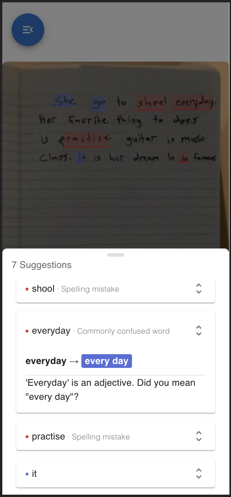
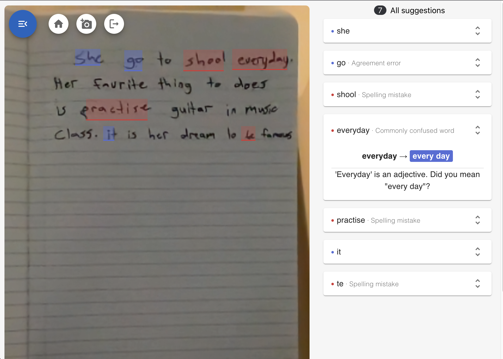
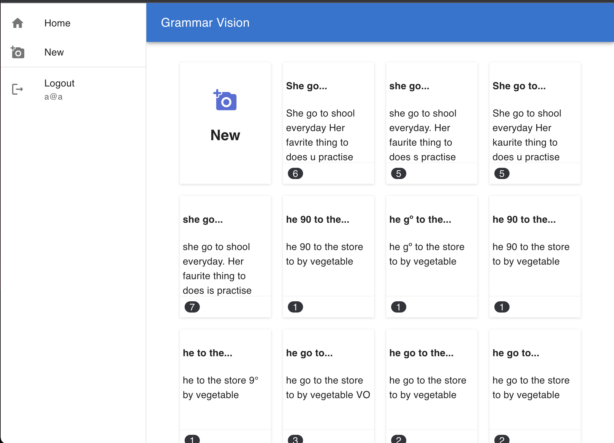
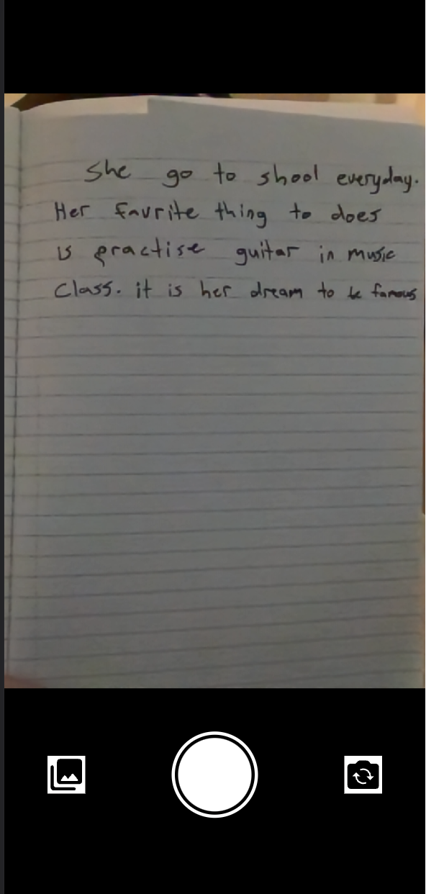
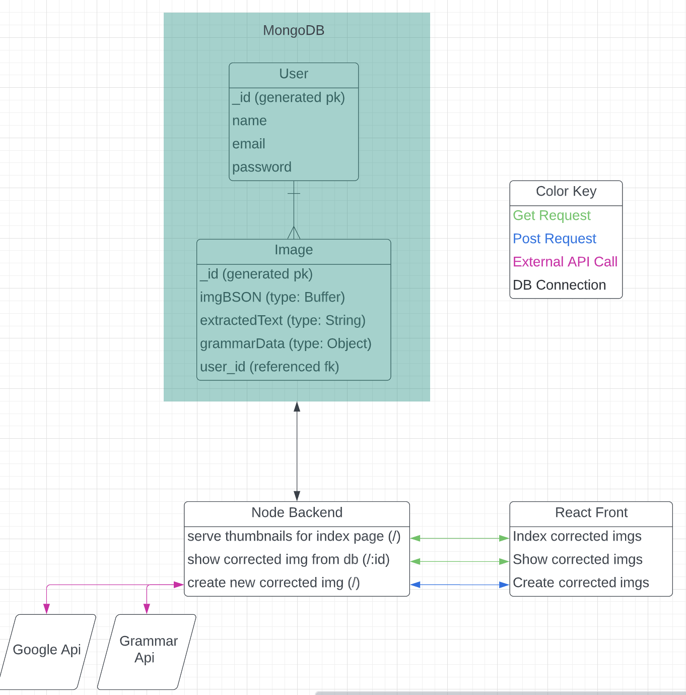

# Grammar Vison 

---

## Description

Full stack MERN app that checks grammar and spelling from images of handwriting. Take a photo of your document from the in-app camera, submit it, and see how you can improve your writing! Link --> https://grammar-vision.wl.r.appspot.com

This app utilizes optical character recognition (ORC) to convert images of handwriting into plain text, which is then checked for spelling and grammar. The grammar data is integrated with the image data in order to annotate the original image.   

## Screenshots

## _Corrected Image (mobile):_

## _Corrected Image (desktop):_

 

## _Home Page (desktop):_

## _Camera (mobile):_

## _Design:_

## Technologies Used
- MERN Stack
- Google Vision Client Library
- Google Cloud Platform (App Engine)
- GrammarBot API
- JWT (JSON Web Token) Auth
- Material UI

## Getting Started

 - ### [APP LINK](https://grammar-vision.wl.r.appspot.com/)

   

## Next Steps
- Currently I am storing images in my database as BLOBs, but I'd like to explore alternatives such as SFS (Secure File System) storage. 
- I opted for the home page to not render the actual images in the card galary to reduce load times, but I'd like to make the home page more image-centric in the future
- Enable search feature
- Let users organize their documents into user-defined categories